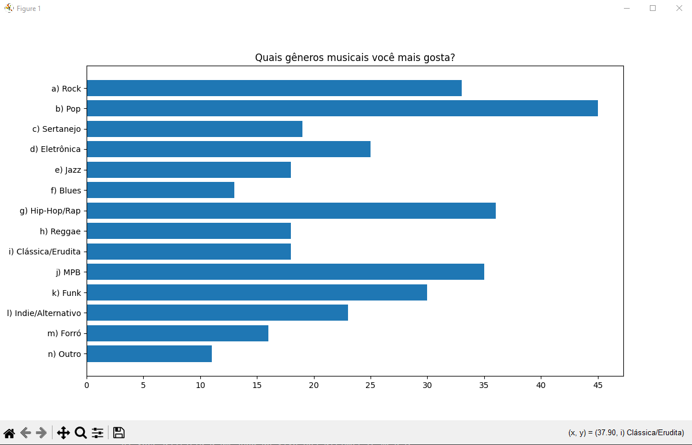

# FIAP - FACULDADE DE INFORMÁTICA E ADMNISTRAÇÃO PAULISTA

## Repositório dedicado a realização do **Checkpoint 2* de **Data Science and Statistical Computing**

### 👨‍🎓 Alunos:
  - Guilherme Santos Nunes | RM:558989.
  - Kaique Rodrigues Zaffarani | RM:556677.
  - Kairo da Silva Silvestre de Carvalho | RM:558288.
  - Rafael Menezes Viana | RM:558287.

### 👨‍🏫 Docente:

  - Marcos Crivelaro.

### 🧑‍💻 Sobre:
> O repositório em questão possui um código '.py' e uma pasta com 10 arquivos '.csv', referentes a
> um formulário criado para obtenção de dados e sua utilização na geração de gráficos. O usuário
> ao iniciar o programa, terá em seu terminal uma interface solicitando o numero do exercicio o
> qual se deseja criar/visualizar um gráfico.

 

 

> Após isso o usuário digita o numero da questão que deseja visualizar, e um gráfico será
> gerado em uma nova janela.

### 📚 Bibliotecas utilizadas:
  - 📊 Matplot: geração e manipulação de gráficos.
   
    Como instalar | No terminal:
        
         pip install matplotlib
  - 🐼 Pandas: manipulação de arquivos '.csv' e criação de dataframes.

    Como instalar | No terminal:

        pip install pandas

